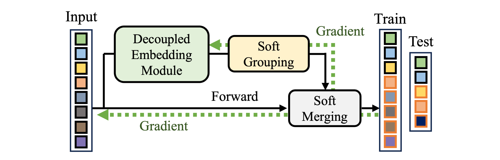

## Learning to Merge Tokens via Decoupled Embedding for Efficient Vision Transformers
This repository contains official code for \
[Learning to Merge Tokens via Decoupled Embedding for Efficient Vision Transformers](https://openreview.net/forum?id=pVPyCgXv57) \
Dong Hoon Lee and Seunghoon Hong
NeurIPS 2024


## Requirements
- `torch==2.0.1`
- `timm==0.9.7`
- `tqdm, wandb, einops`
We also include `environment.yaml` for [conda](https://conda.io) environment. 

## Basic usage
Modular training with DeiT-small on ImageNet-1k:
```
torchrun --nproc_per_node 8 train.py \
    --arch deit-small \
    --data-dir $DATA_DIR \
    --name $NAME \
    --entity $ENTITY \ 
    --project $PROJECT 
```

## Citation
If you find our work useful, please consider citing it:
```
@inproceedings{
    lee2024dtem,
    title={Learning to Merge Tokens via Decoupled Embedding for Efficient Vision Transformers},
    author={Dong Hoon Lee and Seunghoon Hong},
    booktitle={Conference on Neural Information Processing Systems},
    year={2024},
}
```